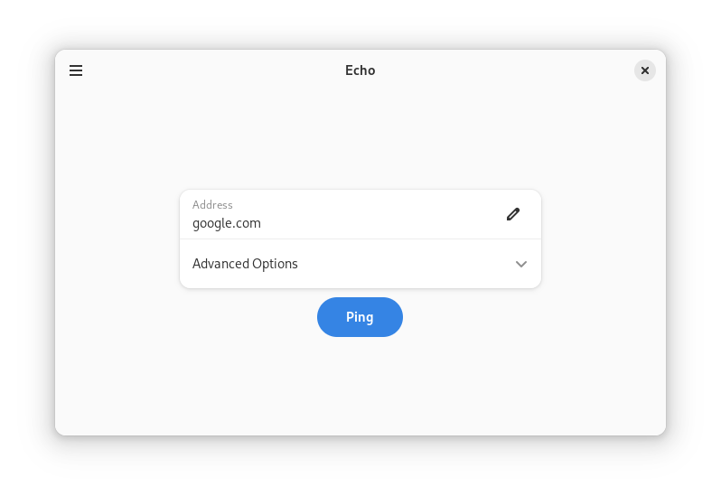

  

  # Echo

  Ping websites

  

## The Project

Echo is a simple utility to ping websites using GTK4 and Libadwaita.

## Features

Besides doing the default ping, you can configure the:
- Number of pings
- Interval between each packet
- Timeout
- And more

## Installation
Get it on Flathub.

## Planned
- Ping history
- Stop ping midway

## Code of Conduct

The project follows the [GNOME Code of Conduct](https://conduct.gnome.org/).
